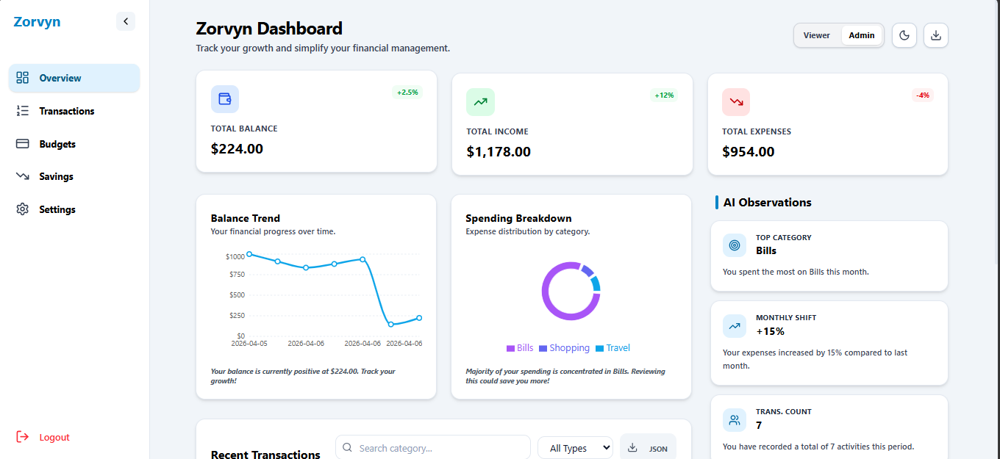
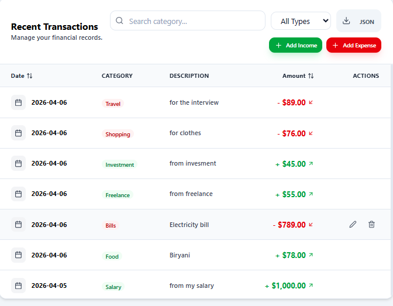

# Zorvyn Dashboard
> A modern dashboard to track and manage financial activity

Zorvyn Dashboard is a premium, responsive finance management interface built with **React**, **Tailwind CSS**, and **Framer Motion**. It provides a comprehensive suite of tools for tracking balances, analyzing spending patterns through interactive visualizations, and managing transactions with a role-based access system.

---

## 🚀 Live Demo
[Insert Deployment Link Here]

---

## ✨ Features

- **Dashboard Overview**: Instant visibility into Total Balance, Total Income, and Total Expenses through high-contrast summary cards.
- **Interactive Charts**:
  - **Line Chart**: Visualize balance trends over time.
  - **Pie Chart**: Detailed breakdown of spending by category using Recharts.
- **Transactions Management**: Complete CRUD functionality (Add, Edit, Delete) for financial records.
- **Advanced Filtering**: Search by category, filter by transaction type (Income/Expense), and sort by date or amount.
- **Role-Based UI**:
  - **Admin**: Full access to manage transactions and export data.
  - **Viewer**: Read-only access to charts and summaries for secure oversight.
- **Real-time Insights**: Automated calculation of top spending categories, monthly comparisons, and transaction metrics.
- **Export Functionality**: One-click data export to **CSV** and **JSON** formats for external analysis.
- **Theme Support**: Robust **Dark Mode** implementation that persists across sessions.
- **Responsive Design**: Fluid layout optimized for Mobile, Tablet, and Desktop screens.
- **Local Storage Persistence**: All transactions, role preferences, and theme settings are saved locally in the browser.

---

## 🛠️ Tech Stack

- **React (Vite)**: For a fast, component-based development experience.
- **Tailwind CSS**: Modern utility-first styling with custom glassmorphism effects.
- **Recharts**: Responsive and composable charting library.
- **Framer Motion**: Smooth micro-interactions and page transitions.
- **Lucide Icons**: Consistent and beautiful vector iconography.

---

## 📂 Folder Structure

```text
src/
├── components/     # UI Components (Header, Table, Charts, etc.)
├── context/        # Global state management using Context API
├── data/           # Mock data and constants
├── hooks/          # Custom React hooks (useFinance, etc.)
├── utils/          # Export utilities and formatters
├── assets/         # Static assets and global styles
└── screenshots/    # Project UI screenshots
```

---

## ⚙️ Installation & Setup

1. **Clone the repository**:
   ```bash
   git clone https://github.com/your-username/zorvyn-dashboard.git
   cd zorvyn-dashboard
   ```

2. **Install dependencies**:
   ```bash
   npm install
   ```

3. **Start the development server**:
   ```bash
   npm run dev
   ```

---

## 📖 Usage Guide

### Switching Roles
Navigate to the header and use the **Role Toggle** to switch between **Viewer** and **Admin**. The UI elements (like "Add Transaction") will appear or disappear based on the active role.

### Managing Transactions
- **Add**: Click "Add Income" or "Add Expense" in the transactions section to open the modernized form.
- **Edit/Delete**: Hover over any row in the transaction table (while in Admin mode) to reveal action icons.

### Exporting Data
Click the **Download icon** in the header or the table area to select between **CSV** or **JSON** export formats.

### Real-time Updates
The **Insights** section and charts update automatically whenever a transaction is added, edited, or deleted, providing an up-to-date financial snapshot.

---

## 🧠 State Management

- **Context API**: Handles global state including transaction data, user roles (`Admin`/`Viewer`), and current filters.
- **Persistence**: `useEffect` hooks synchronize state with `localStorage` to ensure data remains available after refreshing the page.
- **Optimization**: `useMemo` is used extensively for heavy calculations like category spending breakdowns and balance trends to ensure peak performance.

---

## 🎨 UI/UX Highlights

- **Aesthetic Consistency**: Use of custom color tokens, smooth gradients, and glassmorphism.
- **Animation**: Dynamic list transitions and modal pops using Framer Motion.
- **Accessibility**: High-contrast text and intuitive navigation cues.
- **Responsive**: Tailored layouts for every device size, from small phones to large monitors.

---

## 📸 Screenshots


*Main dashboard showing summary cards and interactive charts in a premium dark/light interface.*


*Comprehensive transaction management with advanced filtering and role-based controls.*

---

## 🔮 Future Improvements

- **Backend Integration**: Connect to a live API and database (NodeJS/PostgreSQL).
- **Authentication**: Implement secure user login via JWT or Auth0.
- **Advanced Analytics**: Deeper fiscal forecasting and budget goal tracking.

---

## 🏁 Conclusion

Zorvyn Dashboard was developed to demonstrate a professional, high-performance financial interface. By combining the power of **React Context** for state management with **Tailwind CSS** for premium styling, the project achieves a sleek, "fintech-ready" experience that is both functional and visually stunning.
